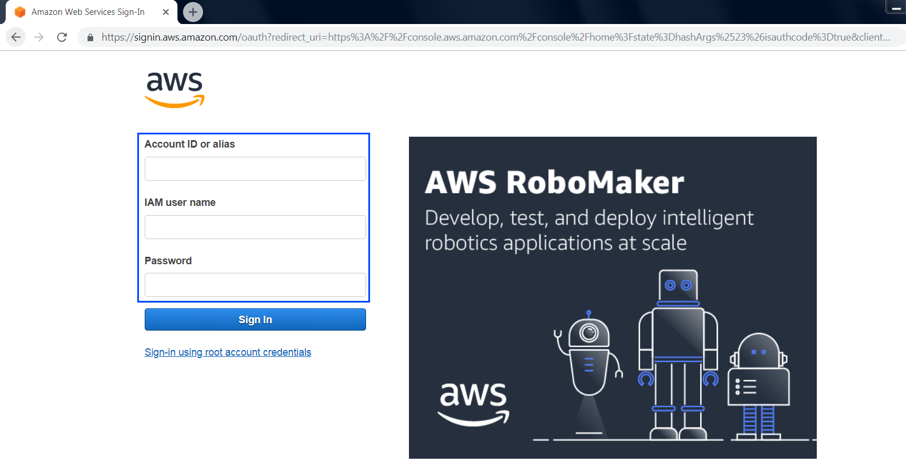
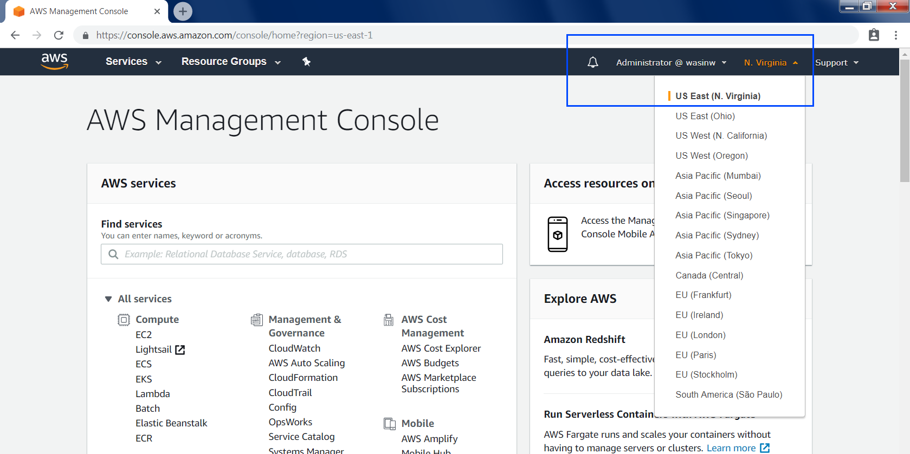
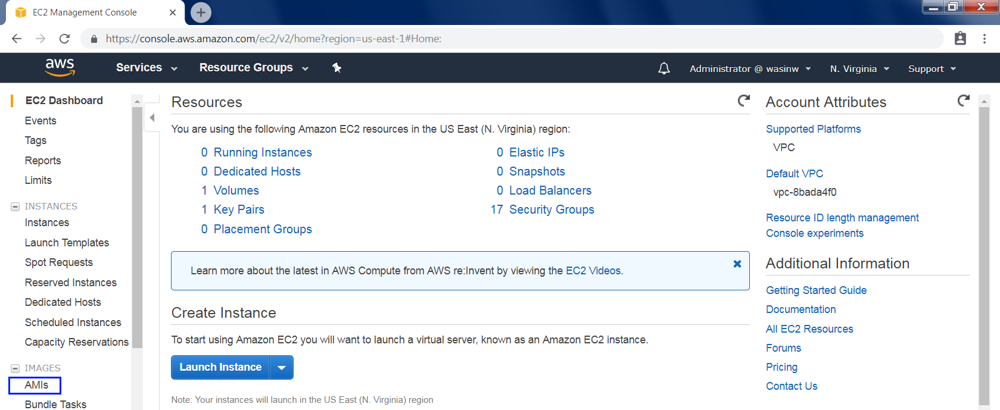
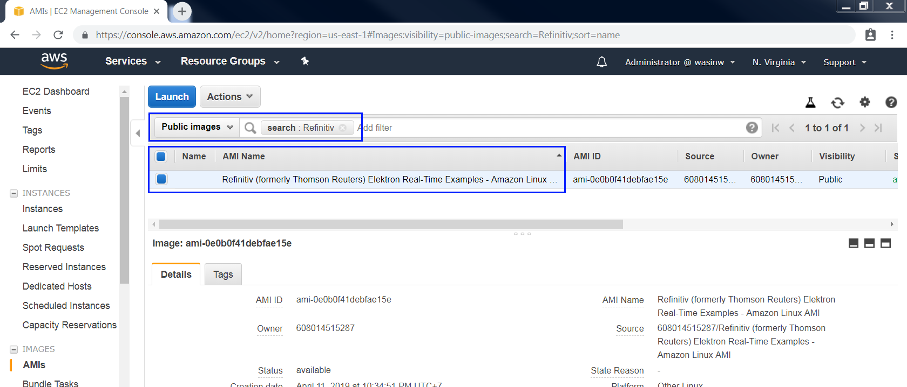
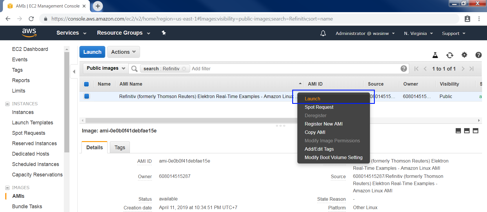
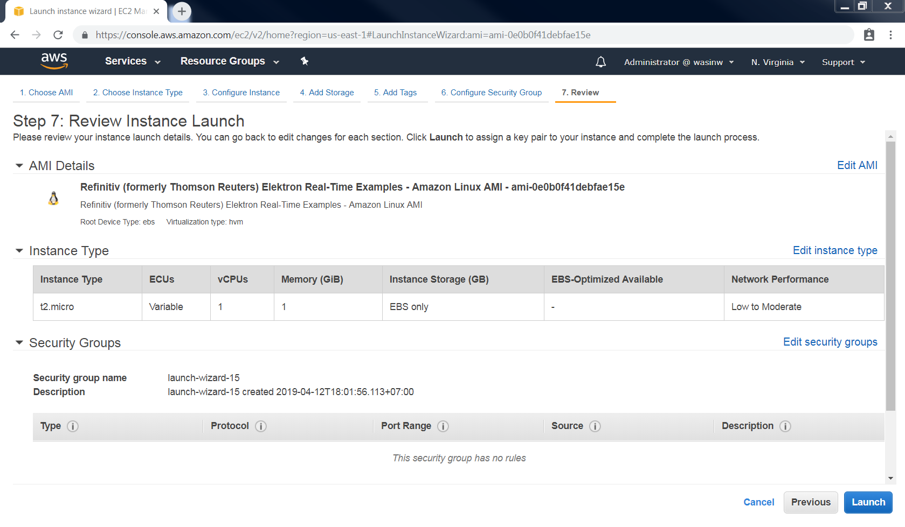
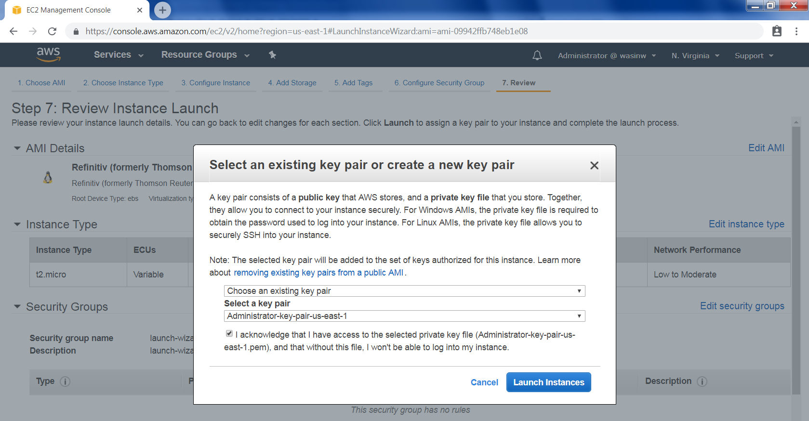
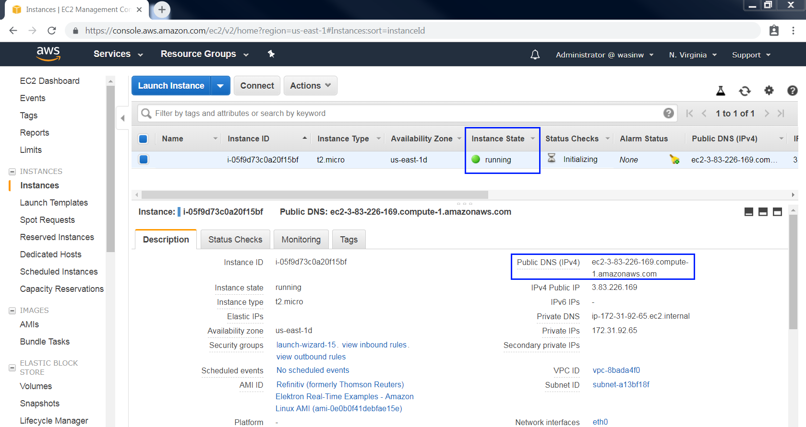
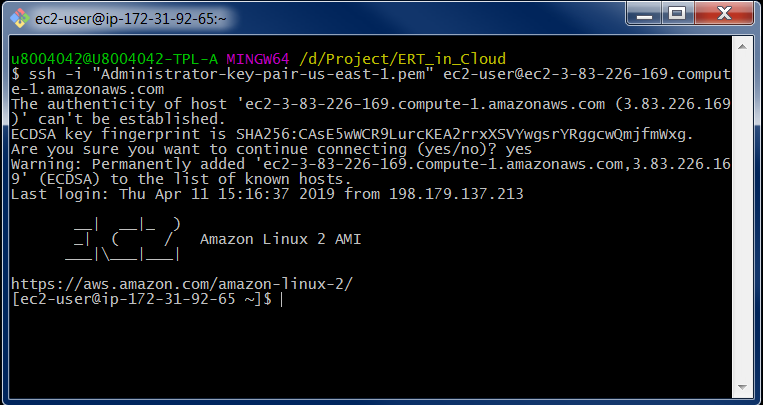

# How to Setup Refinitiv's Amazon EC2 Machine Image for Elektron Real Time in Cloud
- Last update: May 2019
- Environment: Amazon AWS EC2 instance
- Compiler: Python
- Prerequisite: [Access to Amazon AWS EC2](#prerequisite)

## Overview

The goal of this article is to guide you through initial steps to launch an [Amazon AWS EC2](https://aws.amazon.com/ec2/) Instance to run the ERT in Cloud WebSocket Python example from the instance. The instance is based on a Refinitiv Amazon Machine Image ([AMI](https://docs.aws.amazon.com/AWSEC2/latest/UserGuide/AMIs.html)) which included all examples are required libraries for users.  

<!--Once you complete this, further tutorials on using the Elektron Websockets API can be found in the [Elektron WebSocket API page](https://developers.refinitiv.com/elektron/websocket-api) of the [Developer Community](https://developers.refinitiv.com/).-->


## Description In this quick start guide, we will cover the following areas:
- [Prerequisite](#prerequisite)
- [How to launch your EC2 Amazon Linux instance based on Refinitiv's AMI](#launch)
- [How to connect to your EC2 Amazon Linux instance](#connect)
- [How to run ERT in Cloud demo application inside your newly created EC2 Amazon Linux instance](#run_ami)
- [Troubleshooting](#troubleshooting)
- [References](#references)

## <a id="prerequisite"></a>Prerequisite 

The following accounts and softwares are required in order to run this quick start guide:
1. Amazon AWS account
2. Web Browser
3. Internet connection
4. SSH client software or Putty application
5. Amazon AWS key pair
6. ERT in Cloud Username/machine ID and password access credentials. Please reach out to your Refinitiv sales associate to acquire ERT in Cloud Username/machine ID and password access credentials.

If you are new to Amazon AWS, you can subscribe to [AWS Free Tier](https://aws.amazon.com/free/) account which gives you a free hands-on access to AWS platform and services. We highly recommend you follow the Amazon AWS [Setting Up with Amazon EC2](https://docs.aws.amazon.com/AWSEC2/latest/UserGuide/get-set-up-for-amazon-ec2.html) and [Getting Started with Amazon EC2 Linux Instances](https://docs.aws.amazon.com/AWSEC2/latest/UserGuide/EC2_GetStarted.html) tutorials before proceeding futher in this quick start guide to create your key-pair, VPC and Security Group which are required for your EC2 instance.

## <a id="launch"></a>How to launch your EC2 Amazon Linux instance based on Refinitiv's AMI 
1. Firstly, login to [AWS Management Console](https://console.aws.amazon.com/console/home) with your IAM user. 

    
    
    <!---->

2. Refinitiv AMI is available in **US East (N. Virginia)**, **Asia Pacific (Singapore)** and **EU (Ireland)** Regions. This Quick Start page will use "US East (N. Virginia)" Region as a demonstration. Once you are logged in to the AWS Management Console, choose "US East (N. Virginia)" In the Region section.

     
    
    <!--  -->

3. Go to [EC2 Dashboard](https://console.aws.amazon.com/ec2/v2/home) page, then choose IMAGES -> AMIs section.

     
    
    <!--  -->

4. In the AMIs page, select "Public images" and then search Refinitiv' AMI name with **Refinitiv** name filter.

     
    
    <!--  -->

5. Select Refinitiv AMI, then select "Launch".

     
    
    <!--  -->

6. Select your Instance type based on your preference and requirement, then click "Review and Launch" button. You may choose "Configure Instance Details" button to configure Instance network and public IP address (see more detail [here](https://docs.aws.amazon.com/AmazonVPC/latest/UserGuide/vpc-ip-addressing.html#vpc-public-ip)), storage, etc based on your requirement. Click "Launch" button to launch your EC2 Linux instance.

     

    <!--  -->

7. Select your key pair which will be used to connect to your instance with your local machine. You can also create a new key-pair for this instance here. Click "Launch Instances" button to launch your Linux instance.

     

    <!--  -->

8. Back to EC2 Dashboard, you will see your newly created Amazon Linux instance is running with the instance information such as Instance ID, Public DNS (IPv4), IPv4 Public IP, etc. The main information is Public DNS (IPv4) which is required to connect to this instance.

     

    <!--  -->

## <a id="connect"></a>How to connect to your EC2 Amazon Linux instance

Once your Amazon Linux instance is running, you can connect to your Amazon Linux instance using Putty or SSH client applications. The following information are required to connect to your instance.
- Your private key file (example: key-pair.pem)
- Your Linux instance Public DNS

You can find more details regarding how to connect to your Amazon Linux instance from the following AWS documents links below:
- [Connecting to Your Linux Instance from Windows Using PuTTY](https://docs.aws.amazon.com/AWSEC2/latest/UserGuide/putty.html)
- [Connecting to Your Linux Instance Using SSH](https://docs.aws.amazon.com/AWSEC2/latest/UserGuide/AccessingInstancesLinux.html)

This Quick Start Guide uses [Git Bash](https://git-scm.com/downloads) application as a SSH client to connect to Amazon Linux instance with the following command

```
ssh -i "<your private key file name>" ec2-user@<Your Linux instance Public DNS>
```

Example:
```
ssh -i "Administrator-key-pair-us-east-1.pem" ec2-user@ec2-3-83-226-169.compute-1.amazonaws.com
```
 

<!--  -->

Figure-9: Connecting to AWS Linux instance

## <a id="run_ami"></a>How to run ERT in Cloud demo application inside your newly created EC2 Amazon Linux instance

Once you have connected to your Amazon Linux instance, you will be available in your home folder **/home/ec2-user** location. Your home folder contains the following example and API folders:
- *Elektron-SDK folder*: contains the Elektron SDK [C++](https://developers.refinitiv.com/elektron/elektron-sdk-cc) and [Java](https://developers.refinitiv.com/elektron/elektron-sdk-java) examples for ERT in Cloud's RSSL connection.
- *WebsocketAPI folder*: contains the Elektron WebSocket API examples in Python, Java and C# languages for ERT in Cloud's WebSocket connection.

Each sub folder contains *README.md* file which give you a full description regarding the examples detail and how to run examples. 

Please refer to following the series of ERT in Cloud Quick Start based on your prefer API and connection:
* [Elektron WebSocket API Quick Start - Connecting to Elektron Real Time in Cloud](https://developers.refinitiv.com/elektron/websocket-api/quick-start?content=45253&type=quick_start).
* [EMA Java Quick Start - Connecting to Elektron Real Time in Cloud](https://developers.refinitiv.com/elektron/elektron-sdk-java/quick-start?content=66483&type=quick_start).
* [ETA Java Quick Start - Connecting to Elektron Real Time in Cloud](https://developers.refinitiv.com/elektron/elektron-sdk-java/quick-start?content=66486&type=quick_start).
* [EMA C++ Quick Start - Connecting to Elektron Real Time in Cloud](https://developers.refinitiv.com/elektron/elektron-sdk-cc/quick-start?content=64988&type=quick_start)
* [ETA C++ Quick Start - Connecting to Elektron Real Time in Cloud](https://developers.refinitiv.com/elektron/elektron-sdk-cc/quick-start?content=67018&type=quick_start)

<!--
This Quick Start is focusing on the Pyton's market_price_edpgw_service_discovery.py application. The market_price_edpgw_service_discovery.py file is an example Python application that sends the HTTP request to the EDP Gateway with the specified username and password for authentication, then it receives an authentication token to sends the HTTP request to EDP Streming Service Discovery to get associcate ERT in Cloud endpoint, then it login and consumes real-time streaming quote data from ERT in Cloud via the [Elektron WebSocket API](https://developers.refinitiv.com/elektron/websocket-api).
-->
*Note:* This Refinitiv based AMI machined already installed all examples required libraries for users. 

## <a id="troubleshooting"></a>Troubleshooting

**Q: How can I have Elektron Data Platform username and password**

**A:** Please contact your Refinitiv's Technical Account Manager or Technical Relationship Manager to help you to access EDP account and services.

**Q: I do not have a private key pair file**

**A:** Please follow the steps in [AWS Document: Create a Key Pair](https://docs.aws.amazon.com/AWSEC2/latest/UserGuide/get-set-up-for-amazon-ec2.html#create-a-key-pair) link to create your private key pair file.

**Q: My Amazon EC2 instance does not have a Public DNS IP address**

**A:** The instance Public DNS and IP address need to be configured before launching the instance. Please refer to this [AWS Document: Assigning a Public IPv4 Address During Instance Launch](https://docs.aws.amazon.com/AmazonVPC/latest/UserGuide/vpc-ip-addressing.html#vpc-public-ip) link. This public IPv4 address is automatically released in certain cases (stop instance, etc). If you already launched an instance or need a persistance public IP address, you can associate an [AWS Elastic IP Address](https://docs.aws.amazon.com/AmazonVPC/latest/UserGuide/vpc-eips.html) with the instance.

*Note:* AWS Elastic IP Address is not included in the AWS Free Tier services.

**Q: What should I do after finish running an example application**

**A:** You can "Terminate" instance to delete your E2 instance permanently or "Stop" instance to just shutdown your instance and release all public DNS IP address. Please refer to [AWS Document: Clean Up Your Instance](https://docs.aws.amazon.com/AWSEC2/latest/UserGuide/EC2_GetStarted.html#ec2-clean-up-your-instance) link for more detail. 

## <a id="references"></a>References
For further details, please check out the following resources:
* [Refinitiv Elektron SDK Family page](https://developers.refinitiv.com/elektron) on the [Refinitiv Developer Community](https://developers.thomsonreuters.com/) web site.
* [Developer Webinar Recording: Introduction to Enterprise App Creation With Open-Source Elektron Message API ](https://www.youtube.com/watch?v=2pyhYmgHxlU)
* [Refinitiv Elektron Data Platform](https://developers.refinitiv.com/elektron-data-platform)
* [Refinitiv Elektron: RIC Search](https://developers.refinitiv.com/elektron/websocket-api/dev-tools?type=ric)
* [Refinitiv Data Model Discovery page](https://refinitiv.fixspec.com/specserver/specs/reuters): Explore TR data models, content definitions and data update behaviors

For any question related to this quick start guide or Elektron Real Time in Cloud, please use the Developer Community [Q&A Forum](https://community.developers.thomsonreuters.com/spaces/71/index.html).

<!--* [Refinitiv Elektron WebSocket API: Quick Start Guide](https://developers.thomsonreuters.com/elektron/websocket-api/quick-start)-->
<!--* [Developer Webinar Recording: Introduction to Electron WebSocket API](https://www.youtube.com/watch?v=CDKWMsIQfaw)-->


