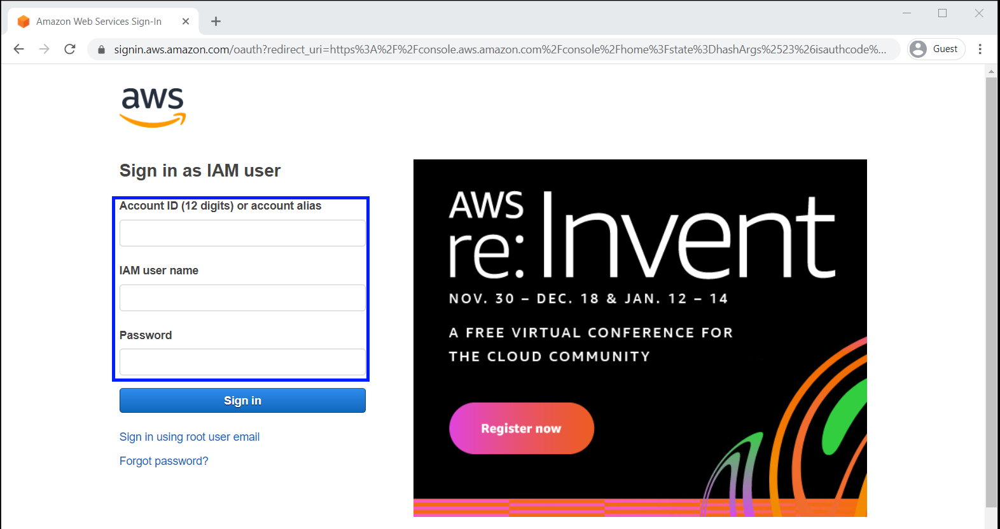
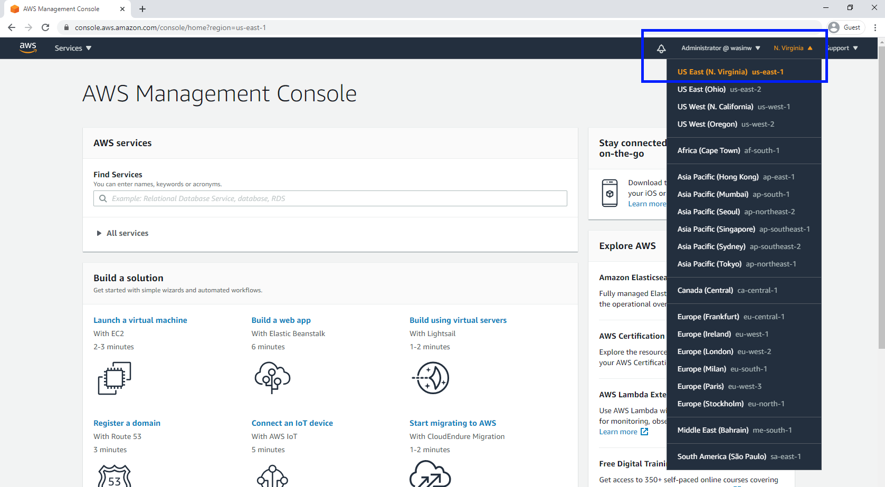
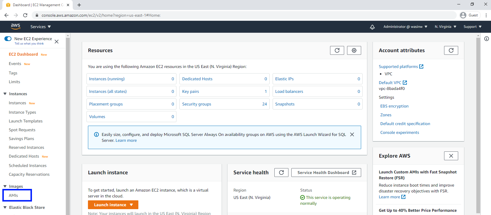
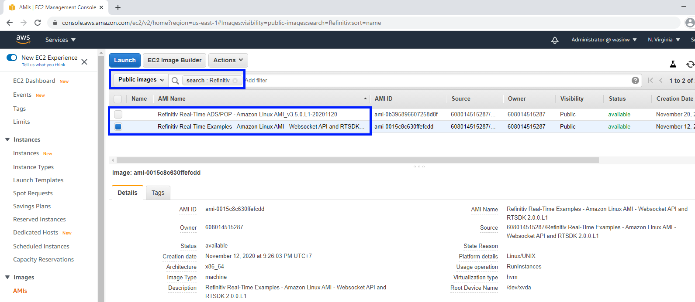
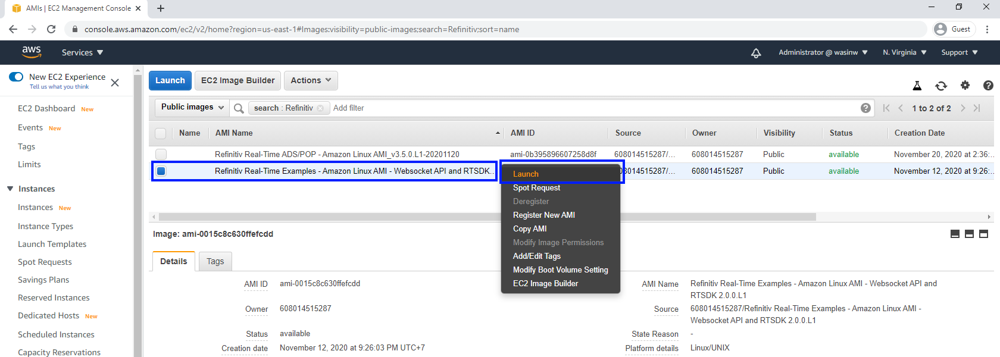
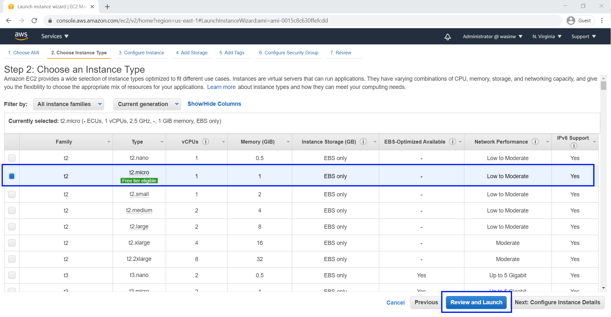
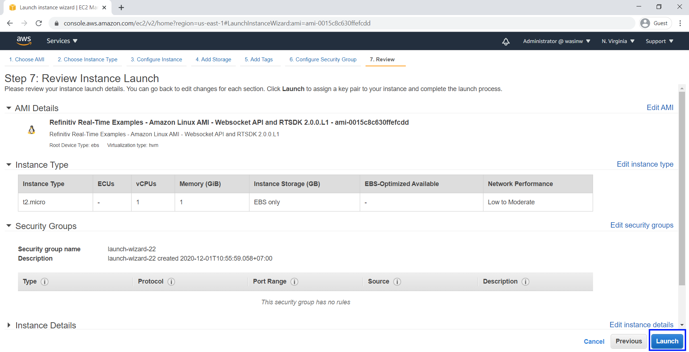
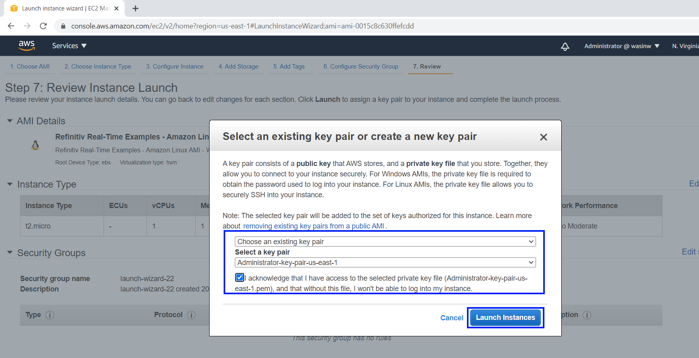
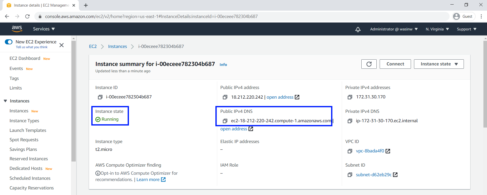
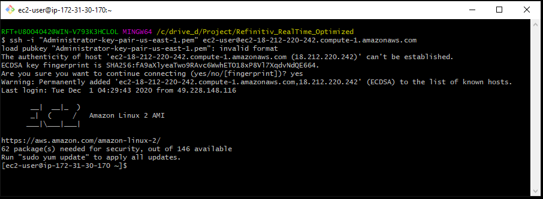

# How to Setup Refinitiv's Amazon EC2 Machine Image for Refinitiv Real-Time - Optimized
- Last update: December 2020
- Environment: Amazon AWS EC2 instance
- Compiler: Python
- Prerequisite: [Access to Amazon AWS EC2](#prerequisite)

## Overview

The goal of this article is to guide you through initial steps to launch an [Amazon AWS EC2](https://aws.amazon.com/ec2/) Instance to run the Refinitiv Real-Time Optimized (formerly known as ERT in Cloud) WebSocket Python example from the instance. The instance is based on a Refinitiv Amazon Machine Image ([AMI](https://docs.aws.amazon.com/AWSEC2/latest/UserGuide/AMIs.html)) which included all examples are required libraries for users.  

<!--Once you complete this, further tutorials on using the Elektron Websockets API can be found in the [Elektron WebSocket API page](https://developers.refinitiv.com/elektron/websocket-api) of the [Developer Community](https://developers.refinitiv.com/).-->


## Description In this quick start guide, we will cover the following areas:
- [Prerequisite](#prerequisite)
- [How to launch your EC2 Amazon Linux instance based on Refinitiv's AMI](#launch)
- [How to connect to your EC2 Amazon Linux instance](#connect)
- [How to run ERT in Cloud demo application inside your newly created EC2 Amazon Linux instance](#run_ami)
- [Troubleshooting](#troubleshooting)
- [References](#references)

## <a id="prerequisite"></a>Prerequisite 

The following accounts and software are required to run this quick start guide:
1. Amazon AWS account
2. Web Browser
3. Internet connection
4. SSH client software or Putty application
5. Amazon AWS key pair
6. Refinitiv Real-Time Optimized Username/machine ID and password access credentials. Please reach out to your Refinitiv sales associate to acquire Refinitiv Real-Time Optimized Username/machine ID and password access credentials.

If you are new to Amazon AWS, you can subscribe to [AWS Free Tier](https://aws.amazon.com/free/) account which gives you free hands-on access to the AWS platform and services. We highly recommend you follow the Amazon AWS [Setting Up with Amazon EC2](https://docs.aws.amazon.com/AWSEC2/latest/UserGuide/get-set-up-for-amazon-ec2.html) and [Getting Started with Amazon EC2 Linux Instances](https://docs.aws.amazon.com/AWSEC2/latest/UserGuide/EC2_GetStarted.html) tutorials before proceeding further in this quick start guide to create your key-pair, VPC, and Security Group which are required for your EC2 instance.

## <a id="launch"></a>How to launch your EC2 Amazon Linux instance based on Refinitiv's AMI 
1. Firstly, log in to [AWS Management Console](https://console.aws.amazon.com/console/home) with your IAM user. 

    

2. Refinitiv AMI is available in [all Regions](https://docs.aws.amazon.com/AWSEC2/latest/UserGuide/using-regions-availability-zones.html#concepts-available-regions). This article will use "US East (N. Virginia)" Region as a demonstration. Once you are logged in to the AWS Management Console, choose your desired Region In the Region section. There might be unavailability of AMI in some Regions for maintenance, please choose other Regions instead.

     
    
3. Go to [EC2 Dashboard](https://console.aws.amazon.com/ec2/v2/home) page, then choose IMAGES -> AMIs section.

     
    
4. On the AMIs page, select "Public images" and then search Refinitiv's AMI name with **Refinitiv** name filter.

     
    
5. Select Refinitiv's AMI name **Refinitiv Real-Time Examples - Amazon Linux AMI**, right-click, and choose "Launch" menu.

     
    
6. Select your Instance type. This article uses Instance type **t2.micro** which is eligible for the Free Tier account as an example. You may choose other instance types based on your cost and requirements. And then click "Review and Launch" button. 

     

7. You may choose "Configure Instance Details" button to configure Instance network and public IP address (see more detail [here](https://docs.aws.amazon.com/AmazonVPC/latest/UserGuide/vpc-ip-addressing.html#vpc-public-ip)), storage, etc based on your requirement. Click "Launch" button to launch your EC2 Linux instance.

     

8. Select your key pair which will be used to connect to your instance with your local machine. You can also create a new key-pair for this instance here. Click "Launch Instances" button to launch your Linux instance.

     

9. Back to EC2 Dashboard, you will see your newly created Amazon Linux instance is running with the instance information such as Instance ID, Public DNS (IPv4), IPv4 Public IP, etc. The main information is Public DNS (IPv4) which is required to connect to this instance.

     


## <a id="connect"></a>How to connect to your EC2 Amazon Linux instance

Once your Amazon Linux instance is running, you can connect to your Amazon Linux instance using Putty or SSH client applications. The following information is required to connect to your instance.
- Your private key file (example: key-pair.pem)
- Your Linux instance Public DNS

You can find more details regarding how to connect to your Amazon Linux instance from the following AWS documents links below:
- [Connecting to Your Linux Instance from Windows Using PuTTY](https://docs.aws.amazon.com/AWSEC2/latest/UserGuide/putty.html)
- [Connecting to Your Linux Instance Using SSH](https://docs.aws.amazon.com/AWSEC2/latest/UserGuide/AccessingInstancesLinux.html)

This Quick Start Guide uses [Git Bash](https://git-scm.com/downloads) application as a SSH client to connect to Amazon Linux instance with the following command

```
ssh -i "<your private key file name>" ec2-user@<Your Linux instance Public DNS>
```

Example:
```
ssh -i "Administrator-key-pair-us-east-1.pem" ec2-user@ec2-3-83-226-169.compute-1.amazonaws.com
```
 

Figure-9: Connecting to AWS Linux instance

Note: You may notice the *invalid format* warning message. The message means the key is a deprecated format, but AWS is still using it. Please see more detail in [this blog post](https://sjsadowski.com/invalid-format-ssh-key/) for full detail of this warning message.

## <a id="run_ami"></a>How to run ERT in Cloud demo application inside your newly created EC2 Amazon Linux instance

Once you have connected to your Amazon Linux instance, you will be available in your home folder **/home/ec2-user** location. Your home folder contains the following example and API folders:
- *RTSDK folder*: contains the Refinitiv Real-Time SDK [C++](https://developers.refinitiv.com/en/api-catalog/elektron/elektron-sdk-cc) and [Java](https://developers.refinitiv.com/en/api-catalog/elektron/elektron-sdk-java) examples for Real-Time Optimized's RSSL connection.
- *WebsocketAPI folder*: contains the [Websocket API for Pricing Streaming and Real-Time Services](https://developers.refinitiv.com/en/api-catalog/elektron/refinitiv-websocket-api) (aka WebSocket API)examples in Python, Java, and C# languages for Real-Time Optimized's WebSocket connection.

Each subfolder contains *README.md* file which gives you a full description regarding the examples detail and how to run examples. 

Please refer to following the series of ERT in Cloud Quick Start based on your preferred API and connection:
* [WebSocket API Quick Start - Connecting to Refinitiv Real-Time Optimized](https://developers.refinitiv.com/en/api-catalog/elektron/refinitiv-websocket-api/quick-start).
* [EMA Java Quick Start - Connecting to Refinitiv Real-Time Optimized](https://developers.refinitiv.com/en/api-catalog/elektron/elektron-sdk-java/quick-start).
* [ETA Java Quick Start - Connecting to Refinitiv Real-Time Optimized](https://developers.refinitiv.com/en/api-catalog/elektron/elektron-sdk-java/quick-startt).
* [EMA C++ Quick Start - Connecting to Refinitiv Real-Time Optimized](https://developers.refinitiv.com/en/api-catalog/elektron/elektron-sdk-cc/quick-start)
* [ETA C++ Quick Start - Connecting to Refinitiv Real-Time Optimized](https://developers.refinitiv.com/en/api-catalog/elektron/elektron-sdk-cc/quick-start)

*Note:* This Refinitiv based AMI machined already installed all examples required libraries for users. 

## <a id="troubleshooting"></a>Troubleshooting

**Q: How can I have Refinitiv Data Platform username, password, and client_id?**

**A:** Please contact your Refinitiv representative to help you with RDP/Refinitiv Real-Time Optimized credential and permission.

**Q: I have tried to use the App Key Generator page to create my client_id but the page keeps asking me Eikon's email username**

**A:** Please contact your Refinitiv representative to help you with RDP/Refinitiv Real-Time Optimized credential and permission.

**Q: I do not have a private key pair file**

**A:** Please follow the steps in [AWS Document: Create a Key Pair](https://docs.aws.amazon.com/AWSEC2/latest/UserGuide/get-set-up-for-amazon-ec2.html#create-a-key-pair) link to create your private key pair file.

**Q: My Amazon EC2 instance does not have a Public DNS IP address**

**A:** The instance Public DNS and IP address need to be configured before launching the instance. Please refer to this [AWS Document: Assigning a Public IPv4 Address During Instance Launch](https://docs.aws.amazon.com/AmazonVPC/latest/UserGuide/vpc-ip-addressing.html#vpc-public-ip) link. This public IPv4 address is automatically released in certain cases (stop the instance, etc). If you already launched an instance or need a persistent  public IP address, you can associate an [AWS Elastic IP Address](https://docs.aws.amazon.com/AmazonVPC/latest/UserGuide/vpc-eips.html) with the instance.

*Note:* AWS Elastic IP Address is not included in the AWS Free Tier services.

**Q: What should I do after I finish running an example application**

**A:** You can "Terminate" instance to delete your E2 instance permanently or "Stop" instance to just shut down your instance and release all public DNS IP address. Please refer to [AWS Document: Clean Up Your Instance](https://docs.aws.amazon.com/AWSEC2/latest/UserGuide/EC2_GetStarted.html#ec2-clean-up-your-instance) link for more detail. 

## <a id="references"></a>References
For further details, please check out the following resources:
* [Refinitiv Real-Time SDK & Distribution APIs page](https://developers.refinitiv.com/en/use-cases-catalog/refinitiv-real-time) on the [Refinitiv Developer Community](https://developers.refinitiv.com) web site.
* [Developer Webinar Recording: Introduction to Enterprise App Creation With Open-Source Enterprise Message API ](https://www.youtube.com/watch?v=2pyhYmgHxlU)
* [Refinitiv Data Platform](https://developers.refinitiv.com/refinitiv-data-platform)
<!--* [Refinitiv Elektron: RIC Search](https://developers.refinitiv.com/elektron/websocket-api/dev-tools?type=ric)
* [Refinitiv Data Model Discovery page](https://refinitiv.fixspec.com/specserver/specs/reuters): Explore TR data models, content definitions and data update behaviors-->

For any question related to this quick start guide or Refinitiv Real-Time - Optimized, please use the Developer Community [Q&A Forum](https://community.developers.refintiv.com/spaces/71/index.html).

<!--* [Refinitiv Elektron WebSocket API: Quick Start Guide](https://developers.thomsonreuters.com/elektron/websocket-api/quick-start)-->
<!--* [Developer Webinar Recording: Introduction to Electron WebSocket API](https://www.youtube.com/watch?v=CDKWMsIQfaw)-->


