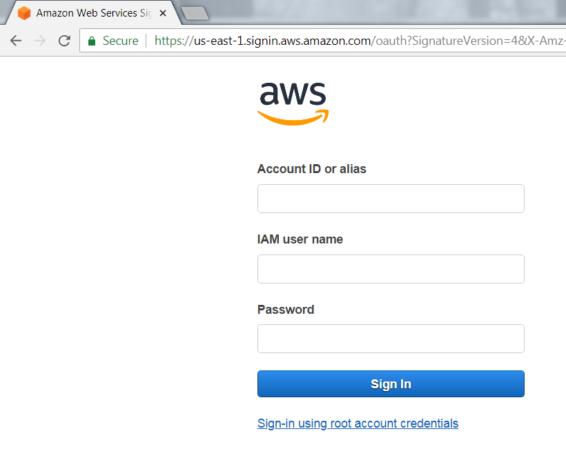
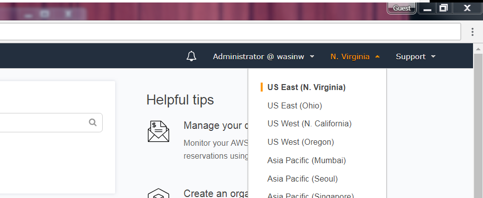
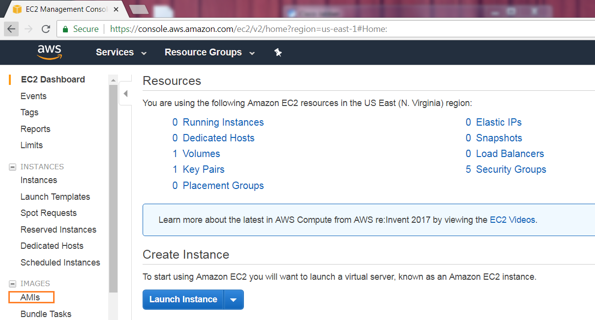
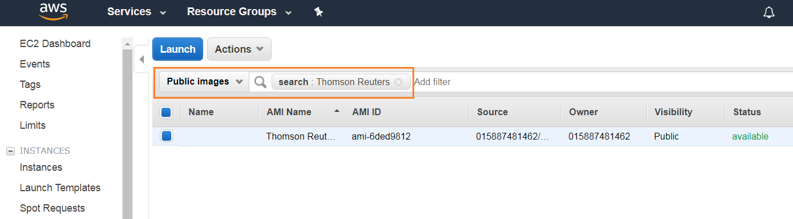
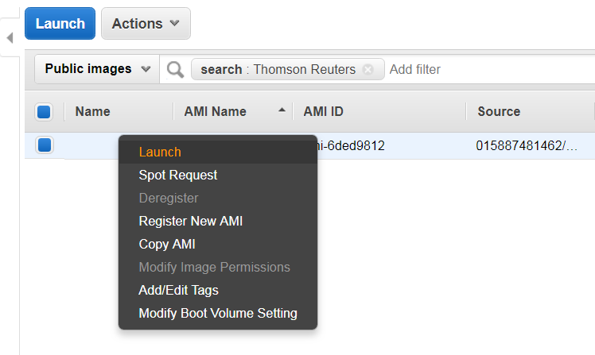
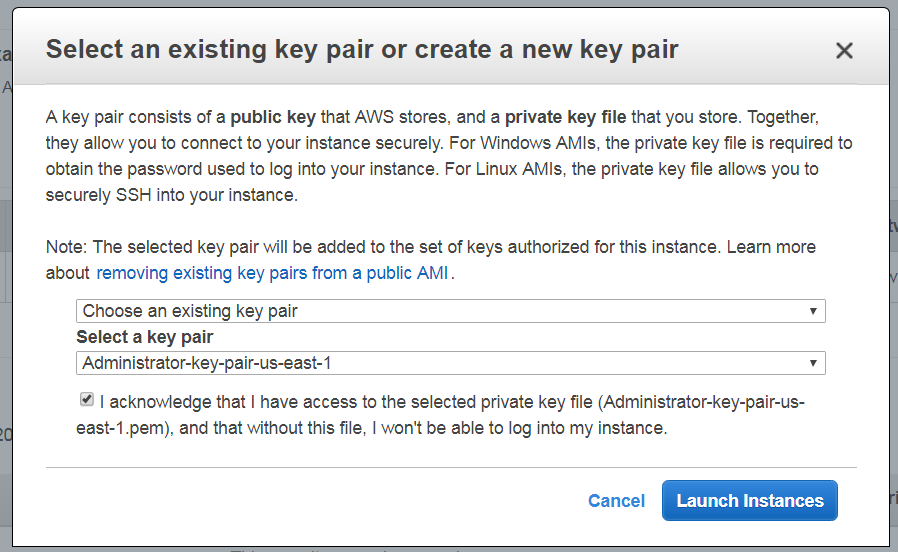
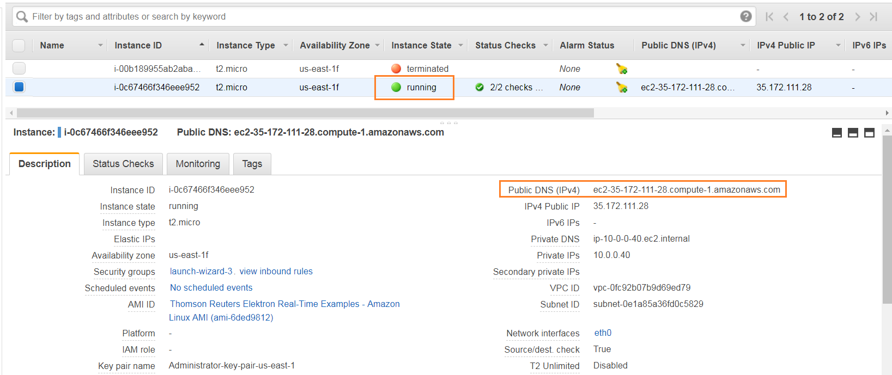
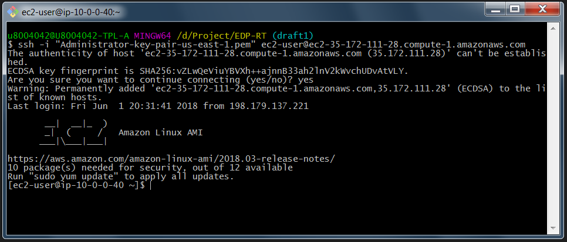
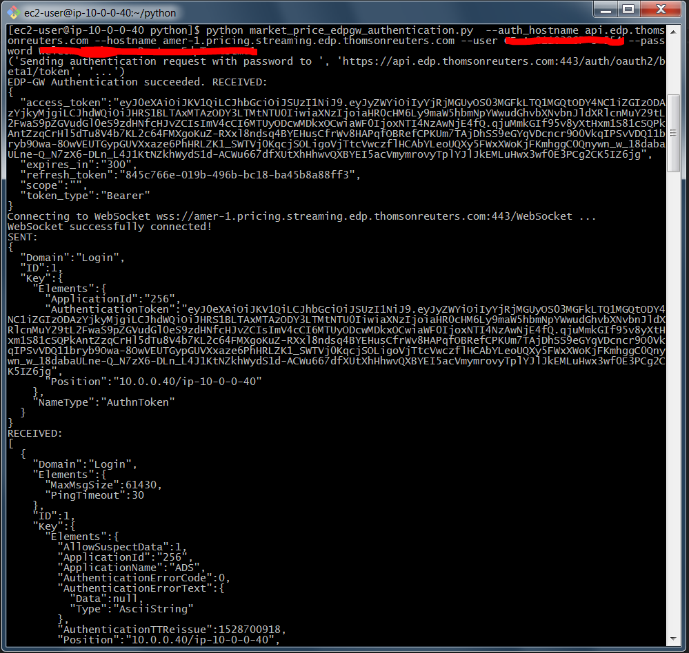
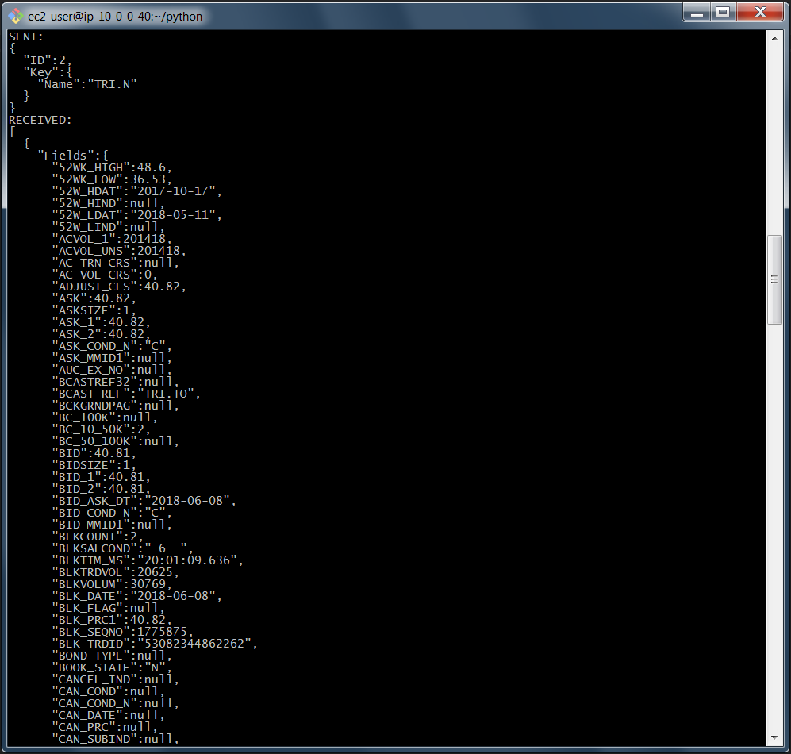

# Elektron Data Platform for Real-Time (EDP-RT)
## Overview
Elektron Data Platform is blah blah blah blah blah.

## Introduction
The goal of this Quick Started tutorial is to guide developers to launch the [Amazon AWS EC2](https://aws.amazon.com/ec2/) Instance based on Thomson Reuters's Amazon Machine Images ([AMI](https://docs.aws.amazon.com/AWSEC2/latest/UserGuide/AMIs.html)) to connect and consume data from EDP-RT.

## Description In this quick start guide, we will cover the following areas:
- Prerequisite
- How to launch your EC2 instance based on Thomson Reuters's AMI 
- How to connect to your EC2 instance
- How to run EDP-RT demo application inside your EC2 instance

## Prerequsit 

The following accounts and softwares are required in order to run this quick start guide:
1. Amazon AWS account
2. Web Browser
3. Internet connection
4. SSH client software or Putty application
5. Amazon AWS key pair

If you are new to Amazon AWS, you can subscribe [AWS Free Tier](https://aws.amazon.com/free/) which provides you a free hand-on access to AWS platform and services. We highly recommend you follow the Amazon AWS [Setting Up with Amazon EC2](https://docs.aws.amazon.com/AWSEC2/latest/UserGuide/get-set-up-for-amazon-ec2.html) and [Getting Started with Amazon EC2 Linux Instances](https://docs.aws.amazon.com/AWSEC2/latest/UserGuide/EC2_GetStarted.html) tutorials before proceed futher in this quick start guide to create your key-pair, VPC and Security Group which are required for EC2 instance.

## How to launch your EC2 instance based on Thomson Reuters's AMI 
1. Login to [AWS Management Console](https://console.aws.amazon.com/console/home) with your IAM user 



2. In the Region section, choose US East (N. Virginia)



3. Go to [EC2 Dashboard](https://console.aws.amazon.com/ec2/v2/home) page, then choose IMAGES -> AMIs section.



4. In the AMIs page, select "Public images" and then search Thomson Reuters' AMI with "Thomson Reuters" filter.



5. Select Thomson Reuters AMI, then select "Launch".



6. Select your Instance type based on your preference, then click "Review and Launch" button. You may choose "Configure Instance Details" button to configure Instance network and public IP address (see more detail [here](https://docs.aws.amazon.com/AmazonVPC/latest/UserGuide/vpc-ip-addressing.html#vpc-public-ip)), storage, etc based on your requirement. Click "Launch" button to launch your EC2 instance.


7. Select your key pair which will be used to connect to your instance. You can also create a new key-pair for this intance here.



8. Back to EC2 Dashboard, you will see your newly created instance is running with the instance information such as Instance ID, Public DNS (IPv4), IPv4 Public IP, etc. The main information is Public DNS (IPv4) which is required to connect to this instance.



## How to connect to your EC2 instance

Once your Linux instance is running, you can connect to your Linux instance using Putty or SSH client applications. The following information are required to connect to your Linux instance.
- Your private key file (example: key-pair.pem)
- Your Linux intance Public DNS

You can find more details regarding how to connect to your Linux instance from the following AWS document links:
- [Connecting to Your Linux Instance from Windows Using PuTTY](https://docs.aws.amazon.com/AWSEC2/latest/UserGuide/putty.html)
- [Connecting to Your Linux Instance Using SSH](https://docs.aws.amazon.com/AWSEC2/latest/UserGuide/AccessingInstancesLinux.html)

This Quick Start Guide uses [Git Bash](https://git-scm.com/downloads) application as a SSH client to connect to AWS Linux instance with the following command

```
ssh -i "<your private key file name>" ec2-user@<Your Linux intance Public DNS>
```

Example:
```
ssh -i "Administrator-key-pair-us-east-1.pem" ec2-user@ec2-35-172-111-28.compute-1.amazonaws.com
```


## How to run EDP-RT demo application inside your EC2 instance

Once you have connected to your Linux instance, you will be avaliable at your home folder **/home/ec2-user** location. Your home folder contains the following file and folder
- *python folder*: contains the market_rpice_edpgw_authentication.py EDP-RT example application and its README files
- *README.txt*: Thomon Reuters Amzon Linux Machine Image README file

The market_rpice_edpgw_authentication.py file is an example application implemented with Python to connect and consume data (TRI.N RIC by default) from EDP-RT via the [Elektron WebSocket API](https://developers.thomsonreuters.com/elektron/websocket-api). This Thomson Reuters based AMI machined already installed all required libraries. 

### Running the example

You can run market_rpice_edpgw_authentication.py application with the following command

```
$>python market_rpice_edpgw_authentication.py --auth_hostname <Hostname of the EDP Gateway> --hostname <Hostname of the Elektron Real-Time Service></Hostname> --user <EDP Username> --password <EDP Password>
```
You can find more detail regarding other optional parameters in the README.txt file. 





## Troubleshooting

**Q: How can I have EDP-RT username and password**

**A:** Please contact your Thomson Reuters's Technical Account Manager or Technical Relationship Manager to help your to access EDP account and services.

**Q: I do not have a private key pair file**

**A:** Please follow the steps in [AWS Document: Create a Key Pair](https://docs.aws.amazon.com/AWSEC2/latest/UserGuide/get-set-up-for-amazon-ec2.html#create-a-key-pair) link to create your private key pair file.

**Q: My Linux instance does not have a Public Public DNS**

**A:** The instance Public DNS and IP address need to be configured before launching the instance. Please refer to this [AWS Document: Assigning a Public IPv4 Address During Instance Launch](https://docs.aws.amazon.com/AmazonVPC/latest/UserGuide/vpc-ip-addressing.html#vpc-public-ip) link. This public IPv4 address is automatically released in certain cases (stop instance, etc). If you already launched the instance or need a persistance public IP address, you can associate an [Elastic IP Address](https://docs.aws.amazon.com/AmazonVPC/latest/UserGuide/vpc-eips.html) with the instance.


