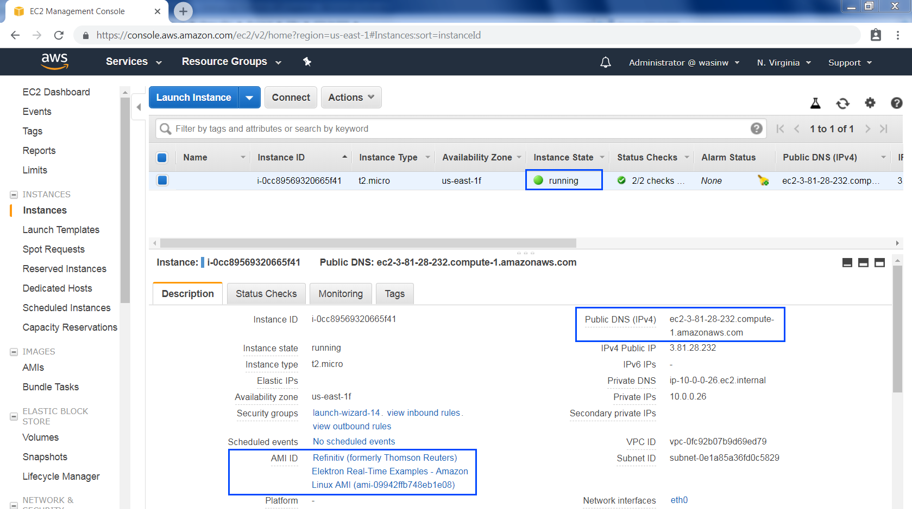

# Elektron Real Time in Cloud (ERT in Cloud) Quick Start
- Last update: December 2018
- Environment: Amazon AWS EC2 instance
- Compiler: Python
- Prerequisite: [Access to Amazon AWS EC2](#prerequisite)

## Overview

The goal of this Quick Start tutorial is to guide you through initial steps to consume data from Thomson Reuters Elektron Data Platform in the [Amazon Cloud](https://aws.amazon.com/), using the Elektron Websocket API by way of a small sample application written in [Python](https://www.python.org/). This tutorial will teach you to launch an [Amazon AWS EC2](https://aws.amazon.com/ec2/) Instance based on a Thomson Reuters Amazon Machine Image ([AMI](https://docs.aws.amazon.com/AWSEC2/latest/UserGuide/AMIs.html)) or to connect to the Elektron Websockets API from your own EC2 instance using provided sample code.

Once you complete this, further tutorials on using the Elektron Websockets API can be found in the [Elektron WebSocket API page](https://developers.thomsonreuters.com/elektron/websocket-api) of the [Developer Community](https://developers.thomsonreuters.com/).

## Connecting to the API from Amazon AWS

Elektron Real Time in Cloud (ERT in Cloud) supports Amazon EC2 instance customers only. Thomson Reuters will not support customers outside of Amazon EC2 service until further notice.

## Description In this quick start guide, we will cover the following areas:
- [Prerequisite](#prerequisite)
- [How to launch your EC2 Amazon Linux instance based on Thomson Reuters's AMI](#launch)
- [How to connect to your EC2 Amazon Linux instance](#connect)
- [How to run ERT in Cloud demo application inside your newly created EC2 Amazon Linux instance](#run_ami)
- [How to run ERT in Cloud demo application from your existing EC2 instance](#run_instance)
- [Troubleshooting](#troubleshooting)
- [References](#references)

## <a id="prerequisite"></a>Prerequisite 

The following accounts and softwares are required in order to run this quick start guide:
1. Amazon AWS account
2. Web Browser
3. Internet connection
4. SSH client software or Putty application
5. Amazon AWS key pair

If you are new to Amazon AWS, you can subscribe to [AWS Free Tier](https://aws.amazon.com/free/) account which gives you a free hands-on access to AWS platform and services. We highly recommend you follow the Amazon AWS [Setting Up with Amazon EC2](https://docs.aws.amazon.com/AWSEC2/latest/UserGuide/get-set-up-for-amazon-ec2.html) and [Getting Started with Amazon EC2 Linux Instances](https://docs.aws.amazon.com/AWSEC2/latest/UserGuide/EC2_GetStarted.html) tutorials before proceeding futher in this quick start guide to create your key-pair, VPC and Security Group which are required for your EC2 instance.

## <a id="launch"></a>How to launch your EC2 Amazon Linux instance based on Thomson Reuters's AMI 
1. Firstly, login to [AWS Management Console](https://console.aws.amazon.com/console/home) with your IAM user 

    
    
    [comment]: # (/sites/default/files/inline/images/edp_rt_1.png)
    <!---->

2. Once you are logged in to the AWS Management Console, choose "US East (N. Virginia)" In the Region section

     
    
    [comment]: # (/sites/default/files/inline/images/edp_rt_2.png)
    <!--  -->

3. Go to [EC2 Dashboard](https://console.aws.amazon.com/ec2/v2/home) page, then choose IMAGES -> AMIs section.

     
    
    [comment]: # (/sites/default/files/inline/images/edp_rt_3.png)
    <!--  -->

4. In the AMIs page, select "Public images" and then search Thomson Reuters' AMI name with **Thomson Reuters Elektron Real-Time Examples - Amazon Linux AMI** name filter.

     
    
    [comment]: # (/sites/default/files/inline/images/edp_rt_4.png)
    <!--  -->

5. Select Thomson Reuters AMI, then select "Launch".

     
    
    [comment]: # (/sites/default/files/inline/images/edp_rt_5_0.png)
    <!--  -->

6. Select your Instance type based on your preference and requirement, then click "Review and Launch" button. You may choose "Configure Instance Details" button to configure Instance network and public IP address (see more detail [here](https://docs.aws.amazon.com/AmazonVPC/latest/UserGuide/vpc-ip-addressing.html#vpc-public-ip)), storage, etc based on your requirement. Click "Launch" button to launch your EC2 Linux instance.

     
    
    [comment]: # (/sites/default/files/inline/images/edp_rt_7.png)
    <!--  -->

7. Select your key pair which will be used to connect to your instance with your local machine. You can also create a new key-pair for this instance here. Click "Launch Instances" button to launch your Linux instance.

     
    
    [comment]: # (/sites/default/files/inline/images/edp_rt_8.png)
    <!--  -->

8. Back to EC2 Dashboard, you will see your newly created Amazon Linux instance is running with the instance information such as Instance ID, Public DNS (IPv4), IPv4 Public IP, etc. The main information is Public DNS (IPv4) which is required to connect to this instance.

     
    
    [comment]: # (/sites/default/files/inline/images/edp_rt_9.png)
    <!--  -->

## <a id="connect"></a>How to connect to your EC2 Amazon Linux instance

Once your Amazon Linux instance is running, you can connect to your Amazon Linux instance using Putty or SSH client applications. The following information are required to connect to your instance.
- Your private key file (example: key-pair.pem)
- Your Linux instance Public DNS

You can find more details regarding how to connect to your Amazon Linux instance from the following AWS documents links below:
- [Connecting to Your Linux Instance from Windows Using PuTTY](https://docs.aws.amazon.com/AWSEC2/latest/UserGuide/putty.html)
- [Connecting to Your Linux Instance Using SSH](https://docs.aws.amazon.com/AWSEC2/latest/UserGuide/AccessingInstancesLinux.html)

This Quick Start Guide uses [Git Bash](https://git-scm.com/downloads) application as a SSH client to connect to Amazon Linux instance with the following command

```
ssh -i "<your private key file name>" ec2-user@<Your Linux instance Public DNS>
```

Example:
```
ssh -i "Administrator-key-pair-us-east-1.pem" ec2-user@ec2-35-174-156-150.compute-1.amazonaws.com
```
 

[comment]: # (/sites/default/files/inline/images/edp_rt_10.png)
<!--  -->

Figure-9: Connecting to AWS Linux instance

## <a id="run_ami"></a>How to run ERT in Cloud demo application inside your newly created EC2 Amazon Linux instance

Once you have connected to your Amazon Linux instance, you will be available in your home folder **/home/ec2-user** location. Your home folder contains the following file and folder
- *python folder*: contains the market_price_edpgw_authentication.py and market_price_edpgw_service_discovery.py ERT in Cloud Python example applications and README.txt files
- *java folder*: contains the MarketPriceEdpGwAuthentication.java and MarketPriceEdpGwServiceDiscovery.java ERT in Cloud Java example applications, library and related files. 
- *CSharp folder*: contains the MarketPriceEdpGwAuthenticationExample and MMarketPriceEdpGwServiceDiscoveryExample ERT in Cloud C# example applications, library and related files. 
- *README.txt*: Thomson Reuters Amazon Linux Machine Image README file

This Quick Start is focusing on the Pyton's market_price_edpgw_service_discovery.py application. The market_price_edpgw_service_discovery.py file is an example Python application that sends the HTTP request to the EDP Gateway with the specified username and password for authentication, then it receives an authentication token to sends the HTTP request to EDP Streming Service Discovery to get associcate ERT in Cloud endpoint, then it login and consumes real-time streaming quote data from ERT in Cloud via the [Elektron WebSocket API](https://developers.thomsonreuters.com/elektron/websocket-api).

*Note:* This Thomson Reuters based AMI machined already installed all Python required libraries. 

## <a id="run_instance"></a>How to run ERT in Cloud demo application from your existing EC2 instance

If you already have an existing instance in your EC2 service, you can download the ERT in Cloud Quick Start example application from [Thomson Reuters Developer Community: Elektron WebSocket API download page](https://developers.thomsonreuters.com/elektron/websocket-api/downloads) and upload the package to your EC2 instance. The ERT in Cloud Quick Start example application contains the same mmarket_price_edpgw_authentication.py, market_price_edpgw_service_discovery.py and README.txt files as same as Thomson Reuters AMI.

Before running the application, you need to install the following required libraries via the ```pip install``` command in your EC2 instance:
- [requests](https://pypi.org/project/requests/) library.
- [websocket-client](https://pypi.org/project/websocket-client/) library (*version 0.49 or greater*).

```
$>sudo pip install requests websocket-client
```

*Note:* 
- Please refer to the [pip installation guide page](https://pip.pypa.io/en/stable/installing/) if your EC2 instance does not have the [pip tool](https://pypi.org/project/pip/) installed. 
- If your EC2 instance already have a websocket-client library installed, you can use ```pip list``` command to verify a websocket-client library version, then use ```pip install --upgrade websocket-client``` command to upgrade websocket-client library. 

### ERT in Cloud connection parameters

The required connections parameters for the ERT in Cloud application are following
- *Authorization host of the EDP Gateway*: You can use *api.edp.thomsonreuters.com:443* to request the access token or pass it to ```---auth_hostname``` parameter on the application command line
<!--- *Hostname of the Elektron Real-Time Service endpoint*: You can use *wss://amer-1.pricing.streaming.edp.thomsonreuters.com:443* as you API connection point, or pass it to ```--hostname``` parameter on the application command line.-->
- *User name and Password*: To request your access token you must pass in a user name and password (or specify it with ```--user``` and ```--password``` parameters on the application command line). You will receive your Machine ID as a user name and a link to activate your machine account and set your password via the Welcome Email that you receive when you subscribe to ERT in Cloud. If you do not have that email please contact your Thomson Reuters account team, or if you are not a client please click [Contact Us page](https://my.thomsonreuters.com/ContactUsNew) if you would like to  try Elektron Real Time data.

Optionally, the application subscribes *TRI.N* RIC code from ERT in Cloud by default. You can pass your interested RIC code to ```--ric``` parameter on the application command line. You can find Thomson Reuters RIC Code of your interested instrument via [RIC Search page](https://developers.thomsonreuters.com/elektron/websocket-api/dev-tools?type=ric)

### Running the example

You can run market_price_edpgw_service_discovery.py application with the following command

```
$>python market_price_edpgw_service_discovery.py --auth_hostname <Hostname of the EDP Gateway>  --user <EDP Username> --password <EDP Password>
```

The other optional parameters are explained in the README.txt file. 

Upon execution, you will be presented with authentication and ERT in Cloud Service discovery processes via EDP Gateway REST API, then followed by initial WebSocket connection between the application and ERT in Cloud. 

```
$>python market_price_edpgw_service_discovery.py --auth_hostname api.edp.thomsonreuters.com --user user1 --password password1

('Sending authentication request with password to ', 'https://api.edp.thomsonreuters.com:443/auth/oauth2/beta1/token', '...')
EDP-GW Authentication succeeded. RECEIVED:
{
  "access_token":"<Access Token>",
  "expires_in":"300",
  "refresh_token":"f69c291b-4d1a-48e8-8210-19fad796b924",
  "scope":"",
  "token_type":"Bearer"
}
Sending EDP-GW service discovery request to https://api.edp.thomsonreuters.com/streaming/pricing/v1/
EDP-GW Service discovery succeeded. RECEIVED:
{
  "services":[
    {
      "dataFormat":[
        "tr_json2"
      ],
      "endpoint":"amer-3.pricing.streaming.edp.thomsonreuters.com",
      "location":[
        "us-east-1a",
        "us-east-1b"
      ],
      "port":443,
      "provider":"aws",
      "transport":"websocket"
    },
    {
      "dataFormat":[
        "tr_json2"
      ],
      "endpoint":"amer-2.pricing.streaming.edp.thomsonreuters.com",
      "location":[
        "us-east-1b"
      ],
      "port":443,
      "provider":"aws",
      "transport":"websocket"
    },
    {
      "dataFormat":[
        "tr_json2"
      ],
      "endpoint":"amer-1.pricing.streaming.edp.thomsonreuters.com",
      "location":[
        "us-east-1a"
      ],
      "port":443,
      "provider":"aws",
      "transport":"websocket"
    }
  ]
}
Connecting to WebSocket wss://amer-3.pricing.streaming.edp.thomsonreuters.com:443/WebSocket for session1...
WebSocket successfully connected for session1!
SENT on session1:
{
  "Domain":"Login",
  "ID":1,
  "Key":{
    "Elements":{
      "ApplicationId":"256",
      "AuthenticationToken":<Access Token>",
      "Position":"172.31.95.146/ip-172-31-95-146"
    },
    "NameType":"AuthnToken"
  }
}
RECEIVED on session1:
[
  {
    "Domain":"Login",
    "Elements":{
      "MaxMsgSize":61430,
      "PingTimeout":30
    },
    "ID":1,
    "Key":{
      "Elements":{
        "AllowSuspectData":1,
        "ApplicationId":"256",
        "ApplicationName":"ADS",
        "AuthenticationErrorCode":0,
        "AuthenticationErrorText":{
          "Data":null,
          "Type":"AsciiString"
        },
        "AuthenticationTTReissue":1530508864,
        "Position":"172.31.95.146/ip-172-31-95-146",
        "ProvidePermissionExpressions":1,
        "ProvidePermissionProfile":0,
        "SingleOpen":1,
        "SupportBatchRequests":7,
        "SupportEnhancedSymbolList":1,
        "SupportOMMPost":1,
        "SupportOptimizedPauseResume":0,
        "SupportPauseResume":0,
        "SupportStandby":0,
        "SupportViewRequests":1
      },
      "Name":"AQIC5wM2LY4Sfcz9Qn2Us7g5Ib5L%2BnFvYof2BkNXTAXbNbk%3D%40AAJTSQACMjAAAlNLABM2MjQ0MjU5NzI3ODE2MzM5MTI4AAJTMQACMzI%3D%23"
    },
    "State":{
      "Data":"Ok",
      "Stream":"Open",
      "Text":"Login accepted by host ads-premium-az2-green-2-main-prd.use1-az2."
    },
    "Type":"Refresh"
  }
]
```

Then application will receive an initial image called a RefreshMsg. The RefreshMsg or initial image contains all fields for the requested instrument representing the latest up-to-date market values. Following this image, you will begin to see UpdateMsgs or realtime updates reflecting changes in the market. All messages between the application and ERT in Cloud are in JSON format, you can find more detail regarding the Elektron WebSocket API's JSON message format in [WebSocket API Developer Guide](https://docs-developers.thomsonreuters.com/1528863829980/14977/) link.

You can (Ctrl+C) to exit the application at any time.

```
SENT:
{
  "ID":2,
  "Key":{
    "Name":"TRI.N"
  }
}
RECEIVED: 
[
  {
    "Fields":{
      "DSPLY_NAME":"THOMSON REUTERS",
      "52WK_HIGH":48.6,
      "52WK_LOW":36.53,
      "52W_HDAT":"2017-10-17",
      "52W_HIND":null,
      "52W_LDAT":"2018-05-11",
      "52W_LIND":null,
      "ACVOL_1":198379,
      "ACVOL_UNS":198379,
      "AC_TRN_CRS":null,
      "AC_VOL_CRS":0,
      "ADJUST_CLS":41.0,
      "ASK":40.78,
      "ASKSIZE":1,
      "ASK_1":40.78,
      ...
      "YRLOW":36.53,
      "YRLOWDAT":"2018-05-11",
      "YRLO_IND":"Yr.Low  "
    },
    "ID":2,
    "Key":{
      "Name":"TRI.N",
      "Service":"ELEKTRON_DD"
    },
    "PermData":"AwEBZWLA",
    "Qos":{
      "Rate":"JitConflated",
      "Timeliness":"Realtime"
    },
    "SeqNumber":29678,
    "State":{
      "Data":"Ok",
      "Stream":"Open",
      "Text":"*All is well"
    },
    "Type":"Refresh"
  }
]

RECEIVED: 
[
  {
    "Fields":{
      "ASK":90.2,
      "ASKSIZE":16000,
      "BEST_ASIZ1":16000,
      "QUOTIM":"05:49:53",
      "QUOTIM_MS":20993225
    },
    "ID":2,
    "Key":{
      "Name":"TRI.N",
      "Service":"ELEKTRON_DD"
    },
    "SeqNumber":26768,
    "Type":"Update",
    "UpdateType":"Quote"
  }
]
```

## <a id="troubleshooting"></a>Troubleshooting

**Q: How can I have Elektron Data Platform username and password**

**A:** Please contact your Thomson Reuters's Technical Account Manager or Technical Relationship Manager to help you to access EDP account and services.

**Q: I do not have a private key pair file**

**A:** Please follow the steps in [AWS Document: Create a Key Pair](https://docs.aws.amazon.com/AWSEC2/latest/UserGuide/get-set-up-for-amazon-ec2.html#create-a-key-pair) link to create your private key pair file.

**Q: My Amazon EC2 instance does not have a Public DNS IP address**

**A:** The instance Public DNS and IP address need to be configured before launching the instance. Please refer to this [AWS Document: Assigning a Public IPv4 Address During Instance Launch](https://docs.aws.amazon.com/AmazonVPC/latest/UserGuide/vpc-ip-addressing.html#vpc-public-ip) link. This public IPv4 address is automatically released in certain cases (stop instance, etc). If you already launched an instance or need a persistance public IP address, you can associate an [AWS Elastic IP Address](https://docs.aws.amazon.com/AmazonVPC/latest/UserGuide/vpc-eips.html) with the instance.

*Note:* AWS Elastic IP Address is not included in the AWS Free Tier services.

**Q: What should I do after finish running an example application**

**A:** You can "Terminate" instance to delete your E2 instance permanently or "Stop" instance to just shutdown your instance and release all public DNS IP address. Please refer to [AWS Document: Clean Up Your Instance](https://docs.aws.amazon.com/AWSEC2/latest/UserGuide/EC2_GetStarted.html#ec2-clean-up-your-instance) link for more detail. 

## <a id="references"></a>References
For further details, please check out the following resources:
* [Thomson Reuters Elektron SDK Family page](https://developers.thomsonreuters.com/elektron) on the [Thomson Reuters Developer Community](https://developers.thomsonreuters.com/) web site.
* [Thomson Reuters Elektron WebSocket API page](https://developers.thomsonreuters.com/websocket-api) 
* [Developer Webinar Recording: Introduction to Electron WebSocket API](https://www.youtube.com/watch?v=CDKWMsIQfaw)
* [Thomson Reuters Elektron: RIC Search](https://developers.thomsonreuters.com/elektron/websocket-api/dev-tools?type=ric)
* [Thomson Reuters Data Model Discovery page](https://thomsonreuters.fixspec.com/specserver/specs/reuters): Explore TR data models, content definitions and data update behaviors

For any question related to this quick start guide or Elektron Real Time in Cloud, please use the Developer Community [Q&A Forum](https://community.developers.thomsonreuters.com/spaces/71/index.html).

<!--* [Thomson Reuters Elektron WebSocket API: Quick Start Guide](https://developers.thomsonreuters.com/elektron/websocket-api/quick-start)-->
<!--* [Developer Webinar Recording: Introduction to Electron WebSocket API](https://www.youtube.com/watch?v=CDKWMsIQfaw)-->


